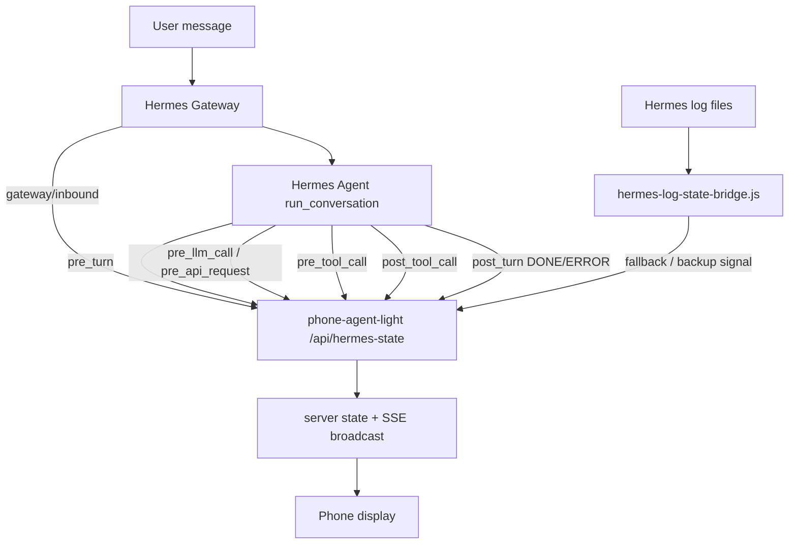

# Design: Phone Agent Light Hermes Display

This document explains the current design logic of this customized Phone Agent Light project.

## Goal

Phone Agent Light turns an old phone or secondary screen into a calm always-on status display for a local AI agent.

The display should behave like a human-readable status light, not like a noisy log monitor:

```text
Idle → Thinking → Running → Done/Error → Idle
```

The preferred portrait display uses four simple Chinese states:

```text
待机摸鱼 → 努力思考中 → 拼命干活中 → 终于完成了 / 出错了 → 待机摸鱼
```

## Core design principles

### 1. Human turn states, not implementation events

Modern AI agents emit many internal events during one user request:

- model request started
- model request finished
- tool call started
- tool call finished
- log line written
- final answer produced
- session saved
- memory synced

The phone should not render every internal event directly. It should show the state of the user-facing turn.

### 2. Start fast

The fastest start signal is emitted at gateway ingress:

```text
Gateway receives inbound message
→ publish THINKING immediately
→ then do session lookup, context construction, and agent startup
```

This is exposed as:

```text
runtime.source = gateway/inbound
status = THINKING
```

A later `pre_turn` hook is still useful because it confirms that the agent has actually entered its turn loop.

### 3. Finish only on the final turn boundary

Intermediate model/API hooks are not final completion signals.

Bad terminal sources:

```text
post_api_request
post_llm_call
post_tool_call
log parser tool completion
```

Correct terminal source:

```text
post_turn
```

`post_turn` means the final assistant answer is known. It should be emitted before slower cleanup work such as session persistence, trajectory saving, memory sync, or shutdown hooks.

### 4. Do not let late internal events overwrite terminal state

A common bug is:

```text
post_turn → DONE
post_llm_call → THINKING
```

The screen then appears to delay completion or regress after completion.

The plugin therefore uses a terminal lock:

```text
post_turn DONE/ERROR → lock terminal state for 3 minutes
new pre_turn → clear the lock and start a new turn
```

During the lock, non-terminal events are ignored.

### 5. No stale-time fallback while working

Once the frontend enters `THINKING` or `RUNNING`, it must not return to `IDLE` just because no new state arrived for a few seconds.

The user-facing rule is intentionally strict:

```text
Only final DONE/ERROR may end a working turn.
DONE/ERROR is held for 3 minutes.
Then the display returns to IDLE.
```

This prevents the display from flickering back to “待机摸鱼” during long model calls or long tool execution.

## Runtime architecture



## Main components

### `server.js`

Node HTTP server.

Responsibilities:

- serve static display pages
- expose `GET /api/state`
- expose `GET /api/events` for SSE live updates
- expose `POST /api/hermes-state` for external status pushes
- persist the latest live state snapshot through `lib/agent-bindings.js`

Default behavior in this customized version:

```text
PORT=8790
DEFAULT_PAGE=display.html
```

### `public/display.html`

Portrait phone display.

It is designed for a simple always-on status screen:

- large local clock
- central pixel character
- one clear state phrase
- simple flow indicator
- small skin switcher

### `public/display.js`

Frontend state machine.

Important rules:

```text
IDLE → THINKING → RUNNING → DONE/ERROR → IDLE
```

- `gateway/inbound`, `pre_turn`, `pre_llm_call`, `pre_api_request` → `THINKING`
- `pre_tool_call`, `post_tool_call`, tool-related signals → `RUNNING`
- `post_turn`, `settled`, explicit final source → `DONE/ERROR`
- once `THINKING` or `RUNNING` starts, do not return to `IDLE` before final `DONE/ERROR`
- hold `DONE/ERROR` for 3 minutes, then return to `IDLE`
- consume terminal snapshots so the same old DONE snapshot is not replayed repeatedly

### `public/display.css`

Dark portrait visual system with pixel-style character skins.

The visual goal is a calm “phone companion” status page instead of a dense monitoring dashboard.

### `lib/agent-bindings.js`

Local agent binding layer.

Notable additions:

- reads and writes a live state snapshot file
- prefers `~/.hermes/agent_live_state.json` when fresh
- filters noisy WeChat/Weixin session errors before generic ERROR detection
- keeps log parsing as a fallback rather than the primary low-latency source

### `scripts/hermes-log-state-bridge.js`

Fallback bridge that tails Hermes logs and pushes state updates.

It is useful when direct hooks are unavailable, but it must yield to hook-sourced state:

```text
hook/*
phone-agent-status/register
gateway/inbound
```

This prevents stale log-derived events from overwriting fresh hook events.

## Recommended Hermes hook contract

The low-latency behavior depends on Hermes or a Hermes plugin publishing these events:

```text
gateway/inbound     → THINKING, immediate ingress pulse
pre_turn            → THINKING, authoritative turn start
pre_llm_call        → THINKING
pre_api_request     → THINKING
pre_tool_call       → RUNNING
post_tool_call      → RUNNING only, never terminal
post_api_request    → live progress only, never terminal
post_llm_call       → live progress only, never terminal
post_turn           → DONE/ERROR, authoritative final state
```

A minimal push payload looks like:

```json
{
  "status": "THINKING",
  "detail": "收到消息，马上处理",
  "updatedAt": "2026-01-01T00:00:00.000Z",
  "task": {
    "active": true,
    "startedAt": "2026-01-01T00:00:00.000Z",
    "endedAt": null,
    "label": "THINKING"
  },
  "runtime": {
    "source": "gateway/inbound",
    "model": "",
    "provider": "",
    "task_id": "",
    "session_id": ""
  }
}
```

## Privacy model

This project is intended for local LAN use.

Important privacy boundaries:

- `.env` is ignored and must not be committed
- logs may contain prompts, file paths, tool outputs, or private messages
- local live state snapshots may contain task/session metadata
- Hermes/Codex bindings should be enabled only when the operator understands what local files are being read
- the display is not an authentication boundary; do not expose it directly to the public internet

## Why this design feels stable

The final behavior is deliberately boring:

```text
Start immediately.
Show thinking/running while work is ongoing.
Do not idle during silence.
Finish only when the agent turn really ends.
Hold completion long enough to be seen.
```

That is the right behavior for an ambient status screen. A dashboard can show noisy implementation details; this screen should not.
